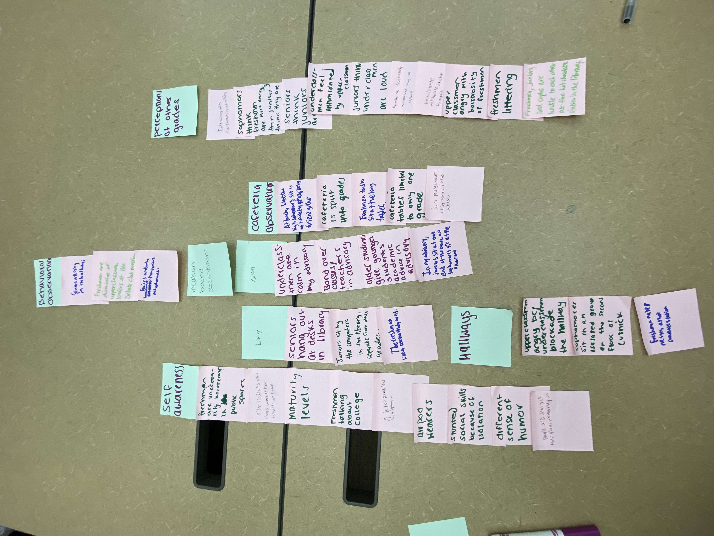

###### Task Review
### Affinity Diagram

### Introduction
Our affinity diagram indicated clear divisions between grades based on locational preferences and behavioral observations. Some of our specific locations included the library, the cafeteria, and classrooms, and we designated specific tasks based on those areas. Some of these behavioral observations included people's willingness to interact with each other, perceptions of other grades, and the type of relationships formed between students of different grades. One template for interactions between grades is formed in HMO, so we also had a task relating to HMO. 

### Tasks:

## Eating Together At Lunch
In the Cohen Dining Commons (more commonly referred to as “the Cafeteria” or “the Caf”), Upper Divisions are usually seated in a common space towards the conveyor belt, a distinct area separate from the middle schoolers. In this space, students are attempting to eat their lunch while socializing in the free time that they have. The Caf is one of two main socialization spaces for high schoolers, and while socializing with friends is a fairly easy task for most students to accomplish, interacting socially with students from different grades is more difficult. In our UX research, we identified that conversations between students of different grades often do not occur because same-grade friend groups are seated at different tables, and few people will choose to “break the ice” and approach a student from a different grade. Therefore, while “eating lunch and socializing in the cafeteria” is an existing task, “eating together” is less of a reality since students are faced with the problem of establishing social connections with an older or younger student.

## Working/Hanging Out with Students in the Library
In Katz Library, Upper Division students gather to finish work and spend time with friends. Unless they are seated on the second floor (which is a “quiet space”), students are usually attempting to perform both these actions simultaneously. This is a fairly simple existing task because students are self-segregated by friend group and grade, with our UX research indicating that juniors sit by the computers while seniors sit at the desks and sophomores/juniors employ the various private rooms in the library. But while the separation makes it easy for students to interact with their close friends while in the library, the separation of grades is also the main problem students are faced with in this task. Since students of different grades are seated in different parts of the library, a self-sustaining cycle of social barriers between older and younger students is established.

## HMO
HMO is a space consisting of a class of freshman and two to three upperclassmen mentors. HMO class happens once a week, in place of a free period. HMO mentors share advice about high school and provide insight into upper division life. The goal of HMO class is not only for incoming freshmen to gain an understanding of the highschool, but to also feel they have an important connection to upperclassmen. Despite the fact that freshmen can gain important insight from these lessons, it’s important that grades have the ability to connect without structure. Because this class is monitored by a teacher, and is in the place of a free, it feels less casual than it potentially could be. We hope to increase more casual interaction between grades. As we learned from our UX research, even if we must initiate connections between grades, it is important that these initiated connections seem as natural as possible. 

## Being in an Advisory with People from Different Grades
Every other Tuesday, during C period, advisors and advisors come together and check in with each other. Advisories contain students from different grades. Advisory begins with check ins, where students are able to share personal or academic stories with each other. When underclassmen talk about their work and classes, upperclassmen are often able to chime in with advice, as they had already been through that course. Because advisory periods do not have specific goals, students from different grades are able to connect in a more natural fashion. We hope to expand on these connections by seeking a way to create connections between grades that are not solely based on academic experiences.

## Being Engaged and Present with Each Other
Underclassmen are often intimidated by the possibility of approaching upperclassmen, not because of poor experiences in interacting with older students, but rather because the older students are sending signals that they do not want to be approached. This also applies to relationships in general between students. As a result, even when surrounded by people it is possible to feel incredibly lonely because no one wants to engage. Often people do want to engage, but since everyone else is on their phone and they don't want to feel awkward, they too will turn to their electronic devices. By having people use their electronic devices less, they open themselves up to social interactions. Unfortunately, this task will be incredibly difficult due to the rise of social media and how connected people can feel through their phones. Whether it is someone liking or commenting on your Instagram post, or sending you a Snap of the ceiling, our phones provide many superficial mediums of communication. As a result, people are hesitant to engage in the real world since they have gotten so used to these more accessible and less difficult modes of communication. But the difficulty in that communication is what makes it worth it when you are able to establish a connection.

## Being Less Judgemental of Other Grades
  Each grade tends to make generalizations about other grades when they don't know anybody in that grade. These generalizations are usually based on one-off experiences with specific members of that grade instead of considering the grade as a whole. In fact, it is practically impossible to generalize a grade at Horace Mann because of the immense diversity we have here. As a result, most generalizations are misguided and can be harmful by preventing the development of potentially fruitful relationships between grades. If people are more willing to have open minds about people from other grades, then we can improve community engagement.

