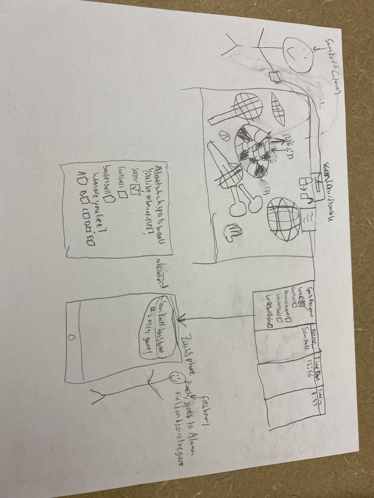

### Tasks:

#### Eating Lunch While Socializing with People from Other Grades
In the Cohen Dining Commons (more commonly referred to as “the Cafeteria” or “the Caf”), Upper Divisions are usually seated in a common space towards the conveyor belt, a distinct area separate from the middle schoolers. In this space, students are attempting to eat their lunch while socializing in the free time that they have. The Caf is one of two main socialization spaces for high schoolers, and while socializing with friends is a fairly easy task for most students to accomplish, interacting socially with students from different grades is a more difficult task. In our UX research, we identified that conversations between students of different grades often do not occur because same-grade friend groups are seated at different tables, and few people will choose to “break the ice” and approach a student from a different grade. Therefore, while “eating lunch and socializing in the cafeteria” is an existing task, “eating together” is less of a reality since students are faced with the problem of establishing social connections with an older or younger student.

#### Working/Hanging Out with Students in the Library From Different Grades
In Katz Library, Upper Division students gather to finish work and spend time with friends. Unless they are seated on the second floor (which is a “quiet space”), students are usually attempting to perform both these actions simultaneously. This is a fairly simple existing task because students are self-segregated by friend group and grade, with our UX research indicating that juniors sit by the computers while seniors sit at the desks and sophomores/juniors employ the various private rooms in the library. But while the separation makes it easy for students to interact with their close friends while in the library, the separation of grades is also the main problem students are faced with in this task. Since students of different grades are seated in different parts of the library, a self-sustaining cycle of social barriers between older and younger students is established.

#### Improving the Connections Gained in HMO
HMO is a space consisting of a class of freshman and two to three upperclassmen mentors. HMO class happens once a week, in place of a free period. HMO mentors share advice about high school and provide insight into upper division life. The goal of HMO class is not only for incoming freshmen to gain an understanding of the high school, but to also feel they have an important connection to upperclassmen. Despite the fact that freshmen can gain important insight from these lessons, it’s important that grades have the ability to connect without structure. Because this class is monitored by a teacher, and is in the place of a free, it feels less casual than it potentially could be. Since every class needs to have a teacher, it is difficult to accomplish the task of making connections formed in HMO feel more genuine. We hope to increase more casual interaction between grades. As we learned from our UX research, even if we must initiate connections between grades, it is important that these initiated connections seem as natural as possible.  

#### Deepening Connections Formed in an Advisory with People from Different Grades
Every other Tuesday, during C period, advisors and advisors come together and check in with each other. Advisories contain students from different grades. Advisory begins with check ins, where students are able to share personal or academic stories with each other. When underclassmen talk about their work and classes, upperclassmen are often able to chime in with advice, as they had already been through that course. Because advisory periods do not have specific goals, students from different grades are able to connect in a more natural fashion. However, the lack of structure in advisory is one of the traits inherent to advisory, so deepening these connections can be difficult. We hope to expand on these connections by seeking a way to create connections between grades that are not solely based on academic experiences.

#### Being Engaged and Present with Each Other
Underclassmen are often intimidated by the possibility of approaching upperclassmen, not because of poor experiences in interacting with older students, but rather because the older students are sending signals that they do not want to be approached. This also applies to relationships in general between students. As a result, even when surrounded by people it is possible to feel incredibly lonely because no one wants to engage. Often people do want to engage, but since everyone else is on their phone and they don't want to feel awkward, they too will turn to their electronic devices. By having people use their electronic devices less, they open themselves up to social interactions. Unfortunately, this task will be incredibly difficult due to the rise of social media and how connected people can feel through their phones. Whether it is someone liking or commenting on your Instagram post, or sending you a Snap of the ceiling, our phones provide many superficial mediums of communication. As a result, people are hesitant to engage in the real world since they have gotten so used to these more accessible and less difficult modes of communication. But the difficulty in that task of communication is what makes it worth it when you are able to establish a connection. 

#### Being Less Judgemental of Other Grades
Each grade tends to make generalizations about other grades when they don't know anybody in that grade. These generalizations are usually based on one-off experiences with specific members of that grade instead of considering the grade as a whole. Eliminating these generalizations will not be as difficult as some of our other tasks because if our students meet a student who contradicts their assumptions, they can change their generalizations. In fact, it is practically impossible to generalize a grade at Horace Mann because of the immense diversity we have here. As a result, most generalizations are misguided and can be harmful by preventing the development of potentially fruitful relationships between grades. If people are more willing to have open minds about people from other grades, then we can improve community engagement.

#### Design 1:

The high level idea behind this design is the unifying power of playing sports. Oftentimes when we have wanted to play sports with my friends or with people who we don't know that well, access to sports equipment is a barrier. Horace Mann has the equipment, but it is saved for the use of sports teams which means students do not have easy access to it. The equipment is saved for the sports teams because there is a fear that students will lose or damage the equipment. If we can eliminate that fear, students can have easy access to equipment which enables them to connect with each other. The way our design removes the fear of lost or damaged sports equipment is by having students scan their id card and type in their name as well as the time at which they checked out the equipment in order to hold students accountable for lost equipment. Students will be more careful with their equipment if they know that they will have to pay for any equipment that they lose.

##### Tasks Completed
Being Engaged and Present:
1. A student or a couple of students from one grade decide in the library they want to play a sports game during their free period, but they need equipment
2. One student scans their ID card, and they unlock the crate in Olshan lobby after going down the stairs.
3. Another student who is currently on their phone gets a notification that a sports game has been started
4. The other student decides to join the game and is no longer on their phone and instead gets good exercise

Being Less Judgemental of Other Grades:
1. A student or a couple of students from one grade decide in the library they want to play a sports game during their free period, but they need equipment
2. One student scans their ID card, and they unlock the crate in Olshan lobby after going down the stairs.
3. Another student who is in a different grade gets a notification that a sports game has been started
4. The other student decides to join the game and talks to the students from a different grade in between moments in the game, thus eliminating any misconceptions that student has. 

Deepening Connections in Advisory:
1. A student or a couple of students from one grade decide in the library they want to play a sports game during their free period, but they need equipment
2. One student scans their ID card, and they unlock the crate in Olshan lobby after going down the stairs.
3. Another student who is in advisory with that student but doesn't know much more about the other person gets a notification that a sports game has been started
4. The other student decides to join the game and talks to the students in between moments and the game, providing further modes of communication and connection outside of advisory.

Improving the Connections Gained in HMO
1. A student or a couple of students from one grade decide in the library they want to play a sports game during their free period, but they need equipment
2. One student scans their ID card, and they unlock the crate in Olshan lobby after going down the stairs.
3. A younger student who is in HMO with that older student but doesn't know much more about the other person gets a notification that a sports game has been started
4. The younger student decides to join the game and talks to the older students in between moments and the game, providing further modes of communication and connection outside of HMO.

#### Design 2:

Through this design sketch we alleviate the barrier that exists between grades in the library, as well as the feeling of awkwardly rigid structure when being around students in other grades in advisory. The design is an app that connects different grades through means of HM courses. In the search bar, the user will enter a teacher or course at Horace Mann. After entering their search, the user will be presented with an array of group chats titled by their preferred course. By clicking on the course the student belongs to, they enter a group chat composed of any existing Horace Mann student that is either currently taking the course or formerly completed it. As a current student in that class, they will benefit from the advice of students who have already taken the course. When a student finishes the class, the student will remain in the chat, but their role will now be to give advice to others. While the premise of this system is based in academics, the conversation in the chat will naturally evolve into more casual interaction. Grappling with challenging academics and navigating relationships with teachers are experiences every single Horace Mann student can relate to. This base of academic commonalities provide the potential for casual cross grade interaction. 

### Working/hanging out with students in the library from different grades: 
Students who are in the same “group chat” might meet in the library to talk about the class or the teacher, exponentially increasing interaction in the library, blurring the physical divide that impedes connection between high schoolers. 

### Deepening connections formed in an advisory with people from different grades:
This design offers a less structured way of cross grade interaction that may not come naturally from an advisory period. As a result of speaking with older students comfortably, younger students might also feel more inclined to be more open with the older students in their advisory, knowing they share certain commonalities. 
