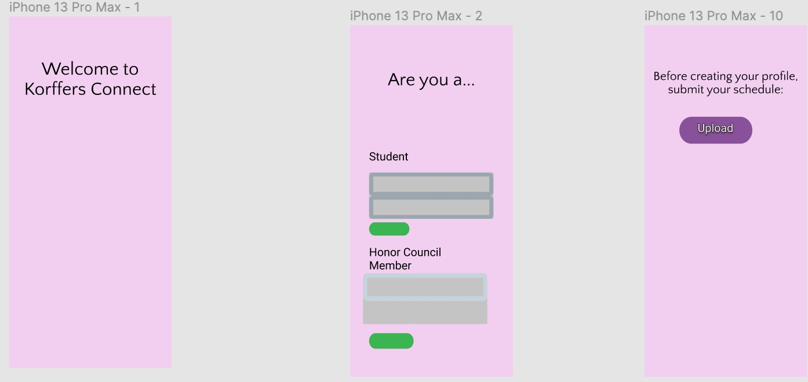
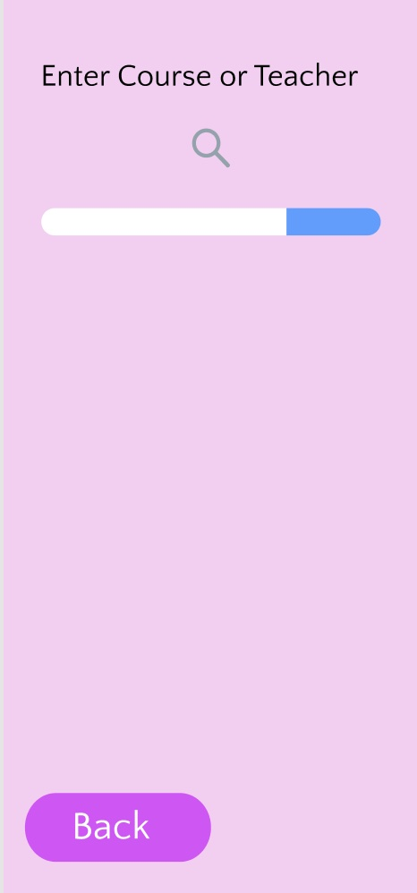
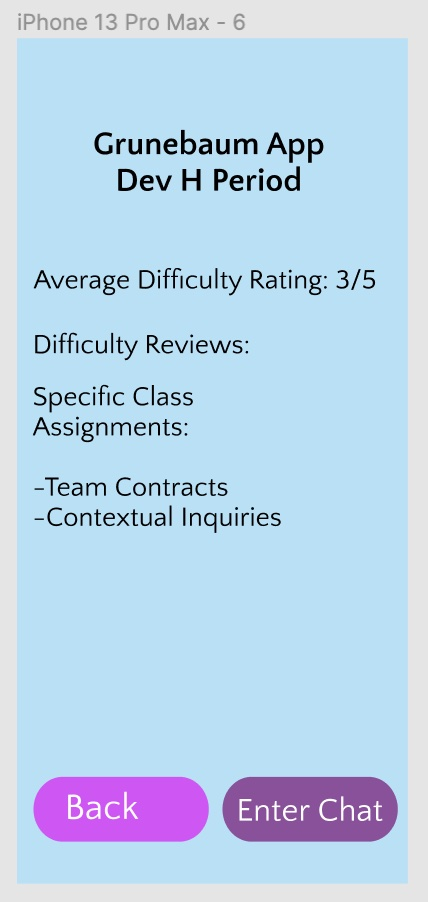
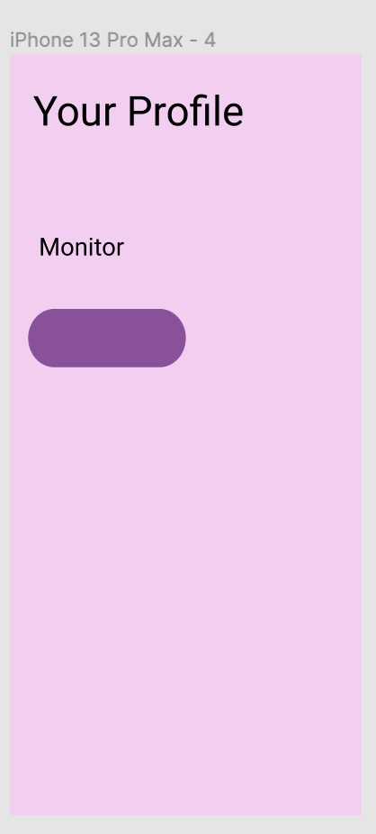
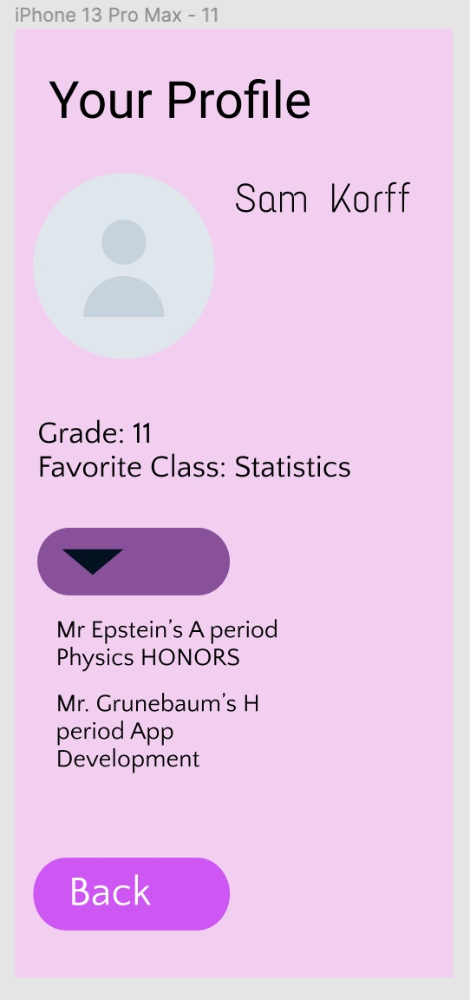

### Usability Testing

#### Test 1
The first test took place in the library with a junior who is not taking our class. This junior has been at the school since the 3s and is an active member of the community who participates in a variety of clubs and classes. We chose this participant to represent the upper division because the upper division themselves have elected them to represent them since they are a member of the community council. We chose to conduct the usability test in the library because it is a space in which high schoolers spend a large part of their time and they would likely be using our app in that space. The procedure for the test was that we opened the app for the junior and gave them some tasks to complete like asking a question about their class and looking at class assignments. We directed the junior through the tasks while taking notes on feedback the junior had. Some changes that we made as a result of this usability test were that we added a screen for students to submit their schedule and a place for them to search through other classes to see what people said about different classes and what classes they would want to take.

All of these issues were severe enough that they necessitated fixing them:

Unsure of what to do after a loading screen - We changed our design so that the “welcome page” automatically faded into the login page, so that users would not be confused about where to click on the screen

Unsure of how the app knows what your schedule is - We created a page after the login that asks the user to upload their schedule to accurately tailor their profile

Unable to go from the login screen to the next screen - Fixed the green buttons below the login panels so that the user can move to the next page

Unable to search for other classes - We added in a search bar page for classes

No example of difficulty reviews - We gave an example of an average difficulty rating

No honor council interface so role of the honor council is unclear - We added a button to illustrate what the honor council would do but not much more because honor council members are a very small part of our user base

#### Test 2
We conducted one of our usability tests on a student who came to our school in the tenth grade. His perspective is extremely valuable to us, as he has had a different experience with Horace Mann as opposed to other high schoolers. We asked him to narrate what he was doing while he was trying our prototype. After he logged in as a student, the first thing he noted was the profile page. He said he was confused by the layout and a clearer profile page would be helpful. From the profile page, he hit the back button, which took him back to the login page. He logged back into the prototype as a student and then checked out the available classes. He commented on the limited options of classes under the dropdown menu. After he entered the “about this class” page, he noted that he would like more information about the classes. From the “about this class” he was unaware where to click. Once we prompted him, he found the chat. His takeaways were that he generally thought the “app was great” but it lacked clarity. He said he often did not know where to click. 

Issues:

Back buttons leading to log in page instead of previous page

Confused by the lack of variety under the “find new classes” dropdown

We fixed the flow of the buttons so that the back button goes to the previous page. We believe that the lack of variety under the “find new classes” dropdown was not an essential fix.

#### Test 3
In our third and final usability test, our participant was a sophomore member of our App Development class. We chose this particular participant because he is an underclassman, and we want to ensure that our app works for members of all grades in the Upper Division (since its purpose is to increase cross-grade communication). We observed him open the app prototype in our App Development classroom and work through the various buttons and options on the site. As he clicked through, it became clear that he wasn’t entirely sure of what he was accomplishing with each step, despite being able to locate most of the buttons that advanced him through the pages on the site. He even told us explicitly that he wasn’t “fully sure of the app’s purpose.” A more specific issue with the functionality of the site was in pressing the back button on any given page. Our tester was unable to return to the previous page after clicking on a dropdown menu; instead, when he clicked the back button, the app fully restarted.

This issue was severe enough to necessitate fixing it:
Back buttons restart the whole app instead of loading the previous page

An issue that is something we will have to be careful of in future additions and modifications we make to our prototype is that the user was unsure of the app’s overarching purpose/affordances.

#### Conclusion:
One of the most important modifications made to our prototype during this process was that we gave our users the ability to search for classes they were interested in. This revision was necessary because one of the times when underclassmen most frequently want to talk to upperclassmen is when they are deciding their schedules and are curious about new classes. Thus, being able to search for these classes and see who has taken them allows the under and upperclassmen to connect. Another critical addition to our design was that we added a button for people to upload their schedule and thus automatically connect them to their peers without making them input each class one by one. If we make it easier for people to use our app it is more likely that they will use it. 

