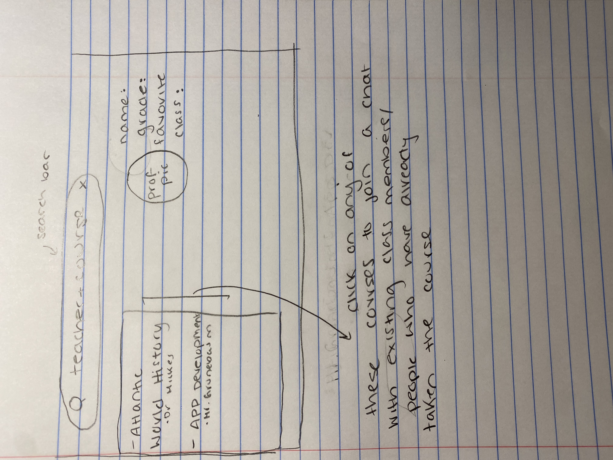
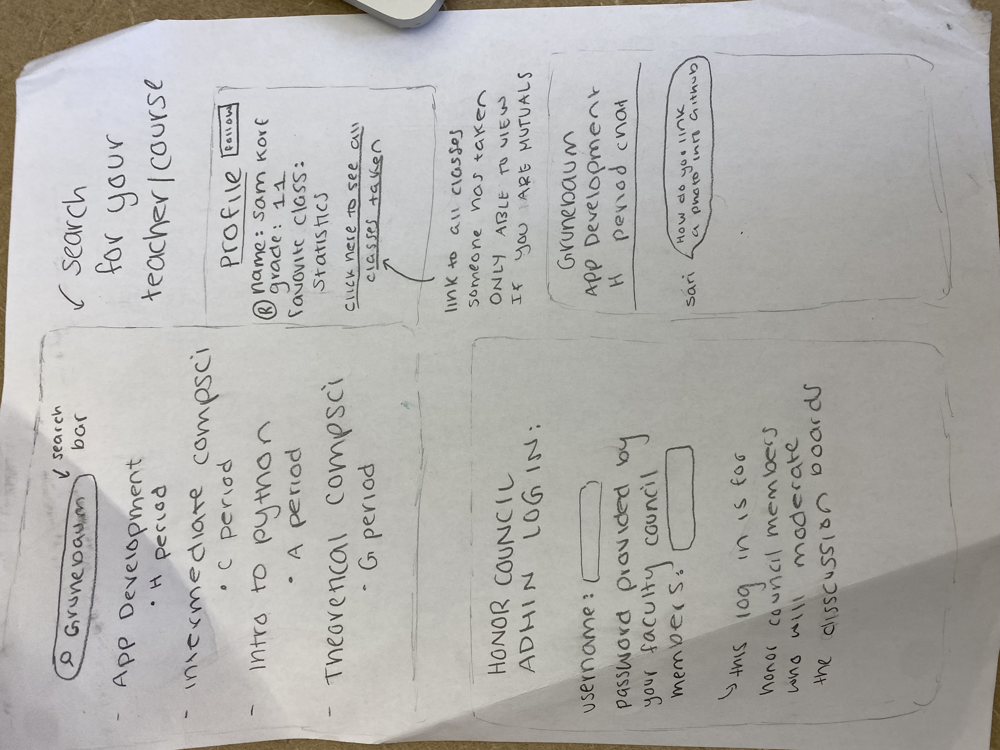

# MannConnect

Sam Korff, Rosie Potash, Jiyon Chatterjee all contributed to all facets of this project.

## Problem Definition and Proposed Solution Overview

At Horace Mann, the interaction among different grades in the high school is stunted, either by anxieties or unwillingness to connect. Our app, Mann Connect, offers a means of connection through collaboration. In our app, users enter their classes and are added to a chat that is composed of current members as well as past members. In the chat, monitored by honor council members, Horace Mann students can help each other through challenging courses. This enforces cross-grade interaction in a less forced, more helpful manner. 

## Contextual Inquiry Results & Key Tasks

We chose to conduct an interview with a teacher instead of a contextual inquiry since our presence could have altered the actions of the students in the advisory. Furthermore, we would have to miss our own advisory period. Additionally, since we only had break period, which lasts 15 minutes, to conduct the interview, it was easier to do that than a more complex form of inquiry that required explanation. An interview was easy because everyone understands what an interview is because they are so mainstream. 
Older students feel a sense of responsibility in their interactions with younger students because of their understanding of how challenging the times of the younger students were. Horace Mann gives students an immense amount of work and stress, and the shared experience of that ordeal causes most older students to be kind and welcoming to younger students. Although there is an expectation from teachers that older students will guide younger students, older students feel that responsibility on their own because of all of the things they wish they had known at that age. Furthermore, there are a variety of factors that influence which older students younger students gravitate to, including gender, shared classes, and shared interests. Finally, in order to improve relationships between grades, upperclassmen need to have the agency of starting casual conversations with underclassmen to decrease the intimidation factor.

## Initial Paper Prototype

We chose the design that allows students to connect with each other through an app that lets them discuss teachers and courses with students who previously had those teachers or courses. This design received the most positive feedback in looking back at our design critiques, and since our peers are the people for whom we are making this design, we took their feedback very seriously. We chose the task of Working/Hanging Out with Students in the Library From Different Grades because the library is the heart of the Horace Mann Upper Division since students from all grades congregate there. However, students don’t usually congregate between grades, which they could do by discussing old courses with older students helping younger students understand the material. Furthermore, we chose the task of Being Less Judgemental of Other Grades, because incorrect preconceptions about other grades is one of the essential barriers to cross grade communication and engagement. Cross-grade interaction in the library is one of the two most important tasks we came up with because the library is the heart of the upper division experience and is one of the most universal parts of the Upper Division. Furthermore, making students less judgemental of other grades is crucial because if people have negative initial impressions of other grades, that can be a difficult barrier to overcome in cross grade interactions.

## Usability Testing Process & Results

Our first usability test took place in Katz Library with a junior who is not taking our class. This was a junior who has been at the school since the 3s and is an active member of the community who participates in a variety of clubs and classes. We chose this participant to represent the Upper Division because the high school itself has elected them to represent them since they are a member of the community council. We chose to conduct the usability test in the library because it is a space in which high schoolers spend a large part of their time and they would likely be using our app in that space. The procedure for the test was that we opened the app for the junior and gave them some tasks to complete, such as asking a question about their class and looking at class assignments. We directed the junior through the tasks while taking notes on any feedback the junior had. We made some changes to our protopype as  a result of this usability test; for example, we added a screen for students to submit their schedule and a place for them to search through other classes to see what people said about different classes and what classes they would want to take.
We conducted our second usability tests on a student who came to HM in the tenth grade. His perspective was extremely valuable to us, as he has had a different experience with Horace Mann as opposed to other high schoolers. We asked him to narrate what he was doing while he was trying our prototype. After he logged in as a student, the first thing he noted was the profile page. He said he was confused by the layout and a clearer profile page would be helpful. From the profile page, he hit the back button, which took him back to the login page. He logged back into the prototype as a student and then checked out the available classes. He commented on the limited options of classes under the dropdown menu. After he entered the “about this class” page, he noted that he would like more information about the classes. From the “about this class” he was unaware where to click. Once we prompted him, he found the chat. His takeaways were that he generally thought the “app was great” but it lacked clarity. He said he often did not know where to click.
In our third and final usability test, our participant was a sophomore member of our App Development class. We chose this particular participant because he is an underclassman, and we want to ensure that our app works for members of all grades in the Upper Division (since its purpose is to increase cross-grade communication). We observed him open the app prototype in our App Development classroom and work through the various buttons and options on the site. As he clicked through, it became clear that he wasn’t entirely sure of what he was accomplishing with each step, despite being able to locate most of the buttons that advanced him through the pages on the site. He even told us explicitly that he wasn’t “fully sure of the app’s purpose.” A more specific issue with the functionality of the site was in pressing the back button on any given page. Our tester was unable to return to the previous page after clicking on a dropdown menu; instead, when he clicked the back button, the app fully restarted.
The following were recurring issues in the usability testing that were severe enough to warrant fixing:
Uncertainty about what to do after a loading screen - We changed our design so that the “welcome page” automatically faded into the login page, so that users would not be confused about where to click on the screen
Uncertainty about how the app knows what your schedule is - We created a page after the login that asks the user to upload their schedule to accurately tailor their profile
Unable to go from the login screen to the next screen - Fixed the green buttons below the login panels so that the user can move to the next page

## Final Paper Prototype and Initial Digital Mockup
In our final paper prototype, we focused on removing barriers between grades by means of a discussion and information forum for HM Upper Division courses. In the search bar, the user could enter a teacher or course at Horace Mann. After entering their search, the user would be presented with an array of group chats titled by their preferred course. By clicking on the course the student belongs to, they enter a group chat composed of any existing Horace Mann student that is either currently taking the course or formerly completed it. As a current student in that class, they would benefit from the advice of students who have already taken the course. When a student finishes the class, the student can remain in the chat, but their role would now be to give advice to others. While the premise of this system is based on academics, the conversation in the chat could naturally evolve into more casual interactions. Grappling with challenging academics and navigating relationships with teachers are experiences that every single Horace Mann student can relate to. This basis of academic commonalities provides the potential for casual cross grade interaction.

We adapted this paper prototype to a digital prototype in Figma. One of the most important modifications made to our prototype during this process was that we gave our users the ability to search for classes they were interested in. This revision was necessary because one of the times when underclassmen most frequently want to talk to upperclassmen is when they are deciding their schedules and are curious about new classes. Thus, being able to search for these classes and see who has taken them allows the under and upperclassmen to connect. Another critical addition to our design was that we added a button for people to upload their schedule and thus automatically connect them to their peers without making them input each class one by one. If we make it easier for people to use our app it is more likely that they will use it.

[Initial digital prototype](https://www.figma.com/file/oag9nknDYIfeCZ6kluSsTW/Korffers-Connect-Design?node-id=0%3A1)

## Digital Mockup & Testing Results
Our digital prototype achieved the task of helping Horace Mann students be less judgemental of other grades through the concept of the design as well as a few specific features we implemented. Our design connects students from different grades through discussions about school and classes, which is something they all have in common. This common ground prevents assumptions and misconceptions. Beyond that, the chat feature in our digital prototype allows students from different backgrounds to simply talk to each other, which is often all that is needed to erase misconceptions.
For the final stage of this project, we chose to do usability tests because even though we could use our design and it made sense to us, we had been working on it. So we needed to determine if people who had not been working on that project could also operate our app. Our participants were two juniors who are not in our App Development class and came to the school at drastically different entry points and a sophomore in our App Development class. These participants gave us a solid distribution of students from different backgrounds and different levels of comprehension of what an app designed in our class looks like.

## Discussion & Implementation Plan
Our last round of testing with the digital mockup returned mostly positive feedback while pointing out a few small issues in our design that we were able to remedy. One such issue is that the student profile page had a back button that took users back to the page where they needed to upload their schedule. However, it did not make sense to have users upload their schedule more than once so we eliminated that back button. Some features that received acclaim were the profile page and the direct messaging feature. On the whole, our project showed us that one of the most effective ways for Horace Mann students to connect with each other is through discussing classes. One of the root causes of this is the diversity of experiences at our school which makes classes one of the few fully shared experiences between students. Although one might worry that discussions about school prevent students from connecting on a deeper level, those surface level interactions allow students to become more comfortable with each other and have more thoughtful conversations later down the line.
Our group has decided we want to use React JS for our app implementation. This software program caters to both Apple and Android devices. Because we value accessibility, we want to be able to serve any user who would like to use our app. React JS is a bit more complex than some of the other software programs, but it serves as a precursor to jobs and topics we may want to explore later in life. As a result of the complexity of React JS, we did not get very far in our implementation. We were able to download React JS and create a sample project but due to the large scope of our design we did not 
We learned that design is a perpetual process of improvement and that we are never done making changes to our design. Every time we made an alteration in one way, we had to rethink all of the components to which that thing we changed was connected. Beyond that, every time we came to a somewhat finished draft of our design, we received more comments from people as to how we could improve our design. However, as we continued to work on the design, the comments we received became more minimal and matters of personal preference. While we of course took into consideration the feedback from each individual, we tried to use the feedback of the majority of people when it came to stylistic features. In spite of the variety in our discussion, most of our conversations made us realize that bonding between HM students most frequently occurs through discussing classes.
If we were to do this project differently, or to pursue it further, we would have made a few changes. First, we would have used more iterations for our design 	so we could more fully flush out our design. While our designs made it quite clear what our intentions were, fully fleshing out each part could have been helpful. Beyond that, we would meet with the administration of the school to determine the feasibility of our app since it would cause a somewhat drastic change in the school. We would also try to expand our team to include more coders who could fully implement our app. However, before any of those steps, we would conduct slightly more usability testing to see if people would be interested in our app idea.
## Appendix

